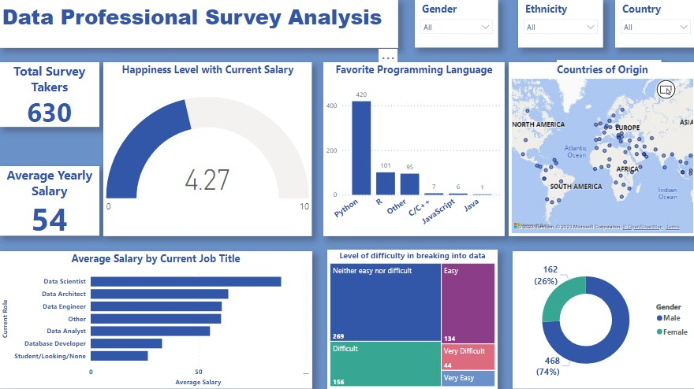
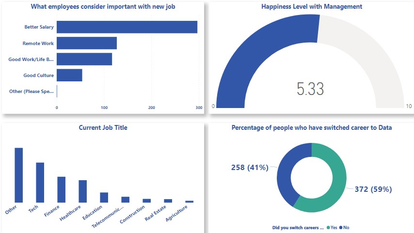

# Data-Professional-Survey-Analysis

## Introduction
This is a Power BI project on a survey ccarried out on data professional. The aim of this project is to show skills in analyzing, visualizing and derive insights to answer crucial questions from data professional and make data driven decisions.

Disclaimer; All datasets and reports do not represent any company, institution or country, but just a dummy dataset to demostrate capabilities of Power BI.

## Problem Statement
To analyze and visualize the surveyed data and observe patterns of this data professionals

## Data Sourcing
Data was downloaded from the web as excel file and then imported into Power BI for analysis. 

## Data Transformation/Cleaning
1. Data cleaning and transformation was carried out using Power Query. After scrutinizing all the columns, they were found to be valid and devoid of empty cells and errors. 
2. However, It was highly important that I transformed the [yearly salary] column which contained bother numbers, variables and special character.
3. Therefore, I used find and replace functions to replace the varaibles, the column was split by using delimeters. 
4. Two columns was created, the average of this columns was taken which gave us the value for the average yearly salary of data professional.
5. The column for [favourite programming language] was also cleaned to reduce the numberous options in the others options of favourite programming language.

# Analysis and Visualization

1. From the dashboard, we see the total number of data professional as 630 and their average yearly salary as 54, 000 dollars.
2. The analysis shows that some data professionals like the Data Scientist are the hightest earners followed by Data Architech, Data Enginer, Data Analyst and the least among them are Database Developers.
3. The analysis also reveal most of this data professionals prefer python as the choice programming language followed by R-programining language.
4. The dashboard also shows that most of our data professionals are male with 76% while the female counterpart is just 26% of data professionals.
5. 269 members of the data professionals surveyed said, it was neither easy nor diffult in breaking into data profession, while 156 disagreed, saying it was diffult , 134 data professionals said it was easy.
6. Most of the data professionals surveyed where not so happy with their current salary. 4.27 on a scale of 10 shows below average level of happiness amongst data engineering.

1. From the surveyed carried out and the analysis done as displayed on the dashboard, data professionals consider better salary as top priority when looking for job or other employment opportunities, other data professionals will consider if the job is remote, has a good work and life balance and good culture in the work environemnt.
2. The happiness level with management amongst data professionals is a bit above average at 5.33
3. There have been quite an interest in data profession, with over 59% of those surveyed admitted to switching their career to becoming data professionla.

